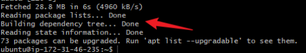
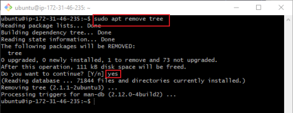

# Mini_Project-Linux_Fundamentals

### In this project, I will be executing basic Linux commands on my Linux instance hosted on AWS Cloud services. 
## The tools I will use for this project include:

- GitBash
- Visual Studio Code
- AWS Instance (Ubuntu machine) &
- GitHub

To create an instance on AWS:
To create an instance on AWS:
## Step One (1)
I logged into my AWS account, navigated to EC2, and clicked on `Launch instances`.

## Step Two (2)
I provided the name of my instance in the `Name` field.

## Step Three (3)
I chose my key pair from my existing key pairs located in my work directory on my local machine.

## Step Four (4)
I left the default settings for the `security group`.

## Step Five (5)
I clicked on `Launch instance`.

## Step Six (6)
My `instance` is now up and running.

## Step Seven (7)
To connect to my instance, I copied the `Public IP address`.

## Connecting to my Instance using Linux Command on GitBash
## Step One (1)
I navigated (cd) to the directory where I saved my key pair and typed the command `ssh -i mykeypair.pem ubuntu@[the instance public IP address]`.

## Step Two (2)
I successfully connected to my AWS instance. 

## Basic Linux Commands
Installing, Updating and Removing Software
- Updating Package List
Before installing new software or updating existing package, it's important to refresh the package lists.

## Installing software Packages
Here I will install a command called `tree` - The `tree` command is commonly used to visually see the file system structure on a Linux server. Below is the command to install it.

## To verify installed packages

## Removing software Packages

### The above implementation details the steps for setting up and managing a Linux instance on AWS, including how to connect to it and perform basic Linux operations.