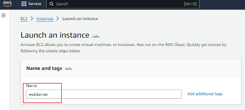
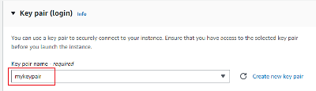
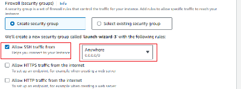

# Mini_Project-Linux_Fundamentals

### In this project, I will be executing basic Linux commands on my Linux instance hosted on AWS Cloud services. 
## The tools I will use for this project include:

- GitBash
- Visual Studio Code
- AWS Instance (Ubuntu machine) &
- GitHub

To create an instance on AWS:
## Step One (1)

## Step Two (2)

## Step Three (3)

## Step Four (4)

## Step Five (5)

## Step Six (6)

## Step Seven (7)

## Connecting to my Instance using Linux Command on GitBash
## Step One (1)

## Step Two (2)

## Basic Linux Commands
Installing, Updating and Removing Software
- Updating Package List
Before installing new software or updating existing package, it's important to refresh the package lists.

## Installing software Packages
Here I will install a command called `tree` - The `` command is commonly used to visually see the file system structure on a Linux server. Below is the command to install it.

